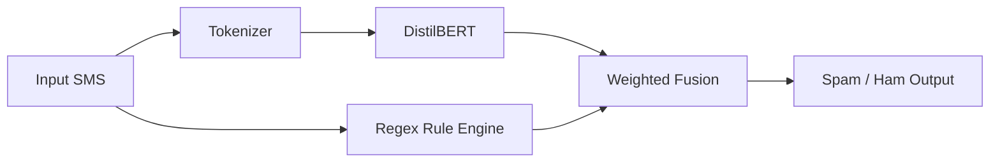

# AI Spam Filter (DistilBERT + Hybrid Rules)


## Overview
An industrial-grade SMS spam filter using a hybrid architecture: DistilBERT for semantic understanding and a regex-based rule engine for structured risk signals. Includes a built-in red/blue team auto-audit script.

## Requirements
- Python 3.12
- TensorFlow 2.x
- Transformers (Hugging Face)
- Pandas, NumPy

## Installation
```bash
pip install -r requirements.txt
```

## Usage
Interactive mode:
```bash
python spam_demo.py
```

Run self-test (auto-audit):
```bash
python auto_audit.py
```

## Architecture


## Performance
- 99%+ training accuracy
- Strong robustness against modern scams (sextortion, stock insider, money mule)

## Disclaimer
For educational purposes only.
